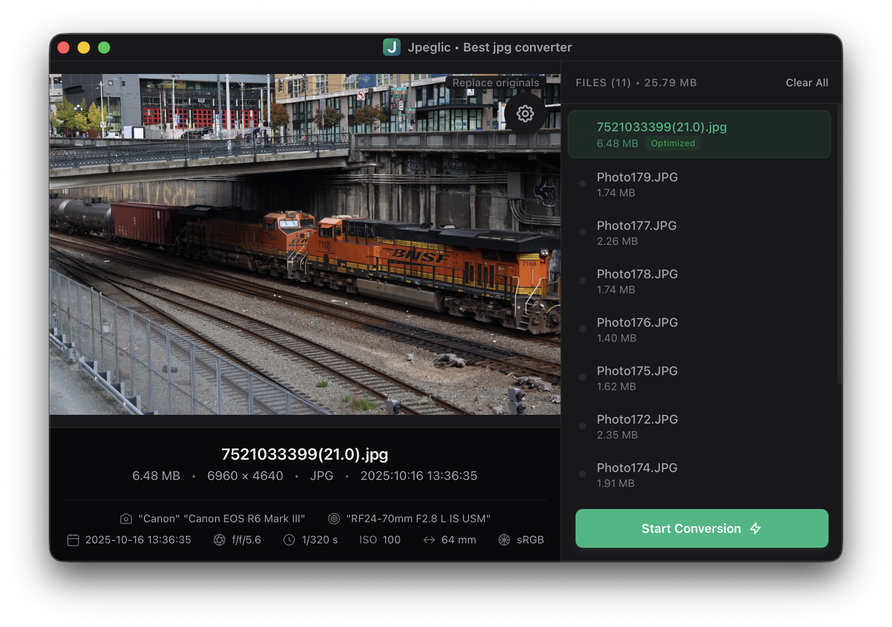

# Jpeglic • Best JPG compressor for home archiving

**Minimalism and uncompromising quality**

Inspired by the magic of JPEGmini, Jpeglic is built for those who cherish their photos and want to preserve them beautifully — without compromise.

A clean, distraction-free interface paired with cutting-edge compression technology. Your memories deserve the best, and Jpeglic delivers it effortlessly.

## The Story Behind Jpeglic

This tool was born from love.

My wife is a photographer. She shoots thousands of photos, edits them carefully in Lightroom, and exports high-quality JPGs — each around 20 MB. Over the years, our family archive grew enormous. Storing and sharing these files became a real headache.

I tried various converters, tweaking quality settings manually, but they always degraded the images noticeably. Then I discovered JPEGmini. It blew my mind: drop a whole folder, no complicated options, and it reduced files 3–4× while keeping quality virtually indistinguishable from the original. It even preserved file structure, metadata, and — in an undocumented gem — skipped already-optimized files if you re-dropped the same folder. Perfect for incrementally updating a multi-year archive.

I used a trial version until it stopped working. Later, I found tools like HiKi recompress that squeezed even more. Curiosity took over: how do they achieve this? That led me down a rabbit hole — jpeg-archive, jpeg-recompress, SSIM, Butteraugli, SSIMULACRA2, VMAF, JpegXL, AVIF, WebP...

Weeks of research, countless tests, and my own needs shaped what Jpeglic is today:

- The best perceptual JPG compression available right now (yes, newer formats can do better, but JPG opens everywhere — even on a toaster).
- Idempotent processing: re-drop the same folders as many times as you want; only new or changed files get optimized.
- Full recursive directory support — ideal for large home archives.
- Blazing-fast multithreading.
- Tiny footprint, no bloat.
- Subtle tuning options for those who know what they're doing.

I built Jpeglic for myself and my family, with heart and soul. If it helps you preserve your own memories a little easier — that's the greatest reward.

## Features

### State-of-the-Art Compression
Advanced psychovisual modeling delivers maximum size reduction with imperceptible quality loss.

### Blazing Fast
Fully multithreaded — processes entire libraries in minutes.

### Memories Preserved
EXIF, ICC profiles, timestamps, and folder structure stay exactly as they were.

### Smart & Safe
- Idempotent: already-optimized files are detected and skipped.
- No accidental overwrites of originals.
- Settings remembered automatically.

### Designed for Real Use
- Live before and after preview.
- Drag & drop files or entire folders (recursive).
- Modern, dark UI that stays out of your way.

## Downloads

Latest release: [v1.0.0](https://github.com/djbob2000/jpeglic/releases/latest) (Windows, macOS)

