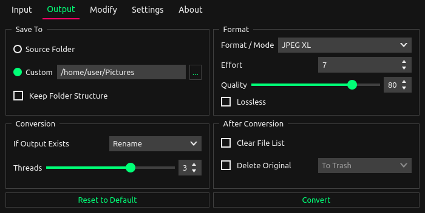

<div align="center">
    
<h3 align="center">XL Converter</h3>

Easy-to-use image converter for modern formats.

Available for Windows and Linux.



Read the [Manual](https://xl-docs.codepoems.eu)
</div>

## Features

#### JPEGLI

Generate fully compatible JPEG images with up to [35% better compression ratio](https://opensource.googleblog.com/2024/04/introducing-jpegli-new-jpeg-coding-library.html).

#### Format Support

Maximize image compression with **JPEG XL** and **AVIF**. Also available: **WebP**, **JPEG**, and **PNG**.

#### Parallel Encoding

Run encoders in parallel for increased throughput.

#### Lossless JPEG Transcoding

Reduce the file size of your JPEG images by 16% - 22% with Lossless JPEG Transcoding. This process is reversible.

#### Downscaling

Scale down images to resolution, percent, shortest (and longest) side, and megapixels.

## Download

[Official website](https://codepoems.eu/xl-converter)

## Building from Source

> [!NOTE]
> The recommended way of using XL Converter is through the [official binary releases](https://codepoems.eu/xl-converter). The building process is time-consuming.

### Windows 10

Install:
- [Python 3.13](https://python.org/downloads/) (check `Add python.exe to PATH`)
- [git](https://git-scm.com/)

Clone the repo.

```cmd
git clone -b stable --depth 1 https://github.com/JacobDev1/xl-converter.git
cd xl-converter
```

[Provide tool binaries](#providing-tool-binaries).

Setup `venv`.

```cmd
python -m venv env_build
env_build\Scripts\activate.bat
pip install -r requirements.txt
```

Install [redistributable](https://aka.ms/vs/17/release/vc_redist.x64.exe)

Run the application.

```cmd
python main.py
```

#### Building

Bundling requires recompiling the bootloader to prevent Windows from deleting the EXE (due to [false positives](https://github.com/pyinstaller/pyinstaller/blob/master/.github/ISSUE_TEMPLATE/antivirus.md)).

Install MSYS2 and launch MINGW64.

```bash
pacman -Syu
pacman -S --needed git cmake mingw-w64-x86_64-gcc
```

Close the MSYS2 terminal and launch CMD inside project's root directory.

> [!IMPORTANT]
> If you upgraded any package, restart the MSYS2 environment. Otherwise, building will start failing for random reasons.

Clone PyInstaller.

```cmd
env_build\Scripts\activate
git clone -b v6.11.1 --depth 1 https://github.com/pyinstaller/pyinstaller.git misc\pyinstaller
```

Recompile the bootloader.

```cmd
cd misc\pyinstaller\bootloader
set PATH=C:\msys64\mingw64\bin;%PATH%
python waf all --gcc
cd ..
pip install .
cd ..\..
```

> ![NOTE]
> The following error may occur `C:\msys64\mingw64\bin\strip.exe: unable to copy file 'runw.exe'; reason: Permission denied`. You can fix it by adding `C:/msys64` to Windows Defender exclusions.

Reload the environment to avoid the `ModuleNotFoundError` error.

```cmd
env_build\Scripts\activate
```

Bundle:

```cmd
python build.py
```

### Linux (Ubuntu-based)

Install packages.

```bash
sudo apt update
sudo apt install git make curl fuse p7zip-full
```

Install [xcb QPA](https://doc.qt.io/qt-6/linux-requirements.html) dependencies.

```bash
sudo apt install '^libxcb.*-dev' libfontconfig1-dev libfreetype6-dev libx11-dev libx11-xcb-dev libxext-dev libxfixes-dev libglu1-mesa-dev libxrender-dev libxi-dev libxkbcommon-dev libxkbcommon-x11-dev
```

Install [pyenv](https://github.com/pyenv/pyenv) via [Automatic installer](https://github.com/pyenv/pyenv?tab=readme-ov-file#automatic-installer) then [add it to shell](https://github.com/pyenv/pyenv?tab=readme-ov-file#set-up-your-shell-environment-for-pyenv)

Install Python build packages.

```bash
sudo apt install wget build-essential libreadline-dev libncursesw5-dev libssl-dev libsqlite3-dev tk-dev libgdbm-dev libc6-dev libbz2-dev libffi-dev zlib1g-dev liblzma-dev
```

Compile and setup Python `3.13`.

```bash
pyenv install 3.13
pyenv global 3.13
```

Clone and set up the repo.

```bash
git clone -b stable --depth 1 https://github.com/JacobDev1/xl-converter.git
chmod -R +x xl-converter
cd xl-converter
```

[Provide tool binaries](#providing-tool-binaries).

Create and activate a virtual environment.

```bash
python -m venv env_build
source env_build/bin/activate
```

Install Python dependencies

```bash
pip install -r requirements.txt
```

Now, you can run it.

```bash
python main.py
```

#### Building

Recompile the bootloader:

```bash
source env_build/bin/activate
git clone -b v6.11.1 --depth 1 https://github.com/pyinstaller/pyinstaller.git misc/pyinstaller
cd misc/pyinstaller/bootloader
python waf all --gcc
cd ..
pip install .
cd ../..
```

Reload the environment to avoid the `ModuleNotFoundError` error.

```bash
source env_build/bin/activate
```

Build:

```bash
python build.py
```

### Providing Tool Binaries

To build XL Converter, you need to provide various binaries. This can be quite challenging.

> [!TIP]
> Use [the official builds](https://github.com/JacobDev1/xl-converter/releases) as a reference.

Libraries:
- [libjxl](https://github.com/libjxl/libjxl) `v0.11.1`
- [libavif](https://github.com/AOMediaCodec/libavif) `v1.2.1` (`libaom` minimum: `v3.12.0` and [SVT-AV1-PSY](https://github.com/psy-ex/svt-av1-psy.git) `v2.3.0-B`)
- [imagemagick](https://imagemagick.org/) `7.x Q16-HDRI`
- [exiftool](https://exiftool.org/) `13.x`
- [libjpeg-turbo](https://github.com/libjpeg-turbo/libjpeg-turbo) `3.1.0`
- [oxipng](https://github.com/shssoichiro/oxipng) `v9.1.4`

Below you'll find references on how to arrange the binaries. You will also need to add dependencies alongside them.

#### Linux (x86_64)

```bash
./xl-converter/bin/linux/
├── avifdec
├── avifenc
├── cjpegli
├── cjxl
├── djxl
├── imagemagick
│   └── magick
├── jpegtran
├── jxlinfo
└── oxipng
```

#### Windows (x86_64)

```bash
./xl-converter/bin/win/
├── exiftool
│   ├── exiftool.exe
│   └── exiftool_files
├── imagemagick
│   └── magick.exe
├── jpegtran
│   └── jpegtran.exe
├── libavif
│   ├── avifdec.exe
│   └── avifenc.exe
├── libjxl
│   ├── cjpegli.exe
│   ├── cjxl.exe
│   ├── djxl.exe
│   └── jxlinfo.exe
└── oxipng
    └── oxipng.exe
```

On Windows, I recommend using MSYS2 MINGW64 for building.

> [!NOTE]
> When building `libjpeg-turbo`, embed [this manifest](https://github.com/AOMediaCodec/libavif/blob/3ec01cefd1ddd266a622d5e114a0888581b68f4a/apps/utf8.manifest) into `jpegtran.exe` with `mt.exe` from Visual Studio. This enables a UTF-8 support in arguments.

> [!TIP]
> Use `ldd` in MSYS2 to check which DLLs need bundling alongside the executables.

## Info

> [!TIP]
> To manage multiple Python versions on Windows, you can use: the `py` launcher or pyenv-win.

## Testing

[Setup repo](#building-from-source).

Create a test environment.

```bash
python -m venv env_dev
source env_dev/bin/activate
pip install -r requirements.txt -r requirements_test.txt
```

### Unit Tests

```cmd
python test.py
```

You can control which tests to run. Run `python test.py --help` to learn more.

### Functional Tests

`test_convert.py` is a separate test suite focusing on validating program's output.

#### Linux

```bash
sudo apt install xvfb
make test-convert
```

#### Windows

```bash
python test_convert.py
```

## Contributing

Before contributing to issues or sending pull requests, please review [CONTRIBUTING.md](./.github/CONTRIBUTING.md).
